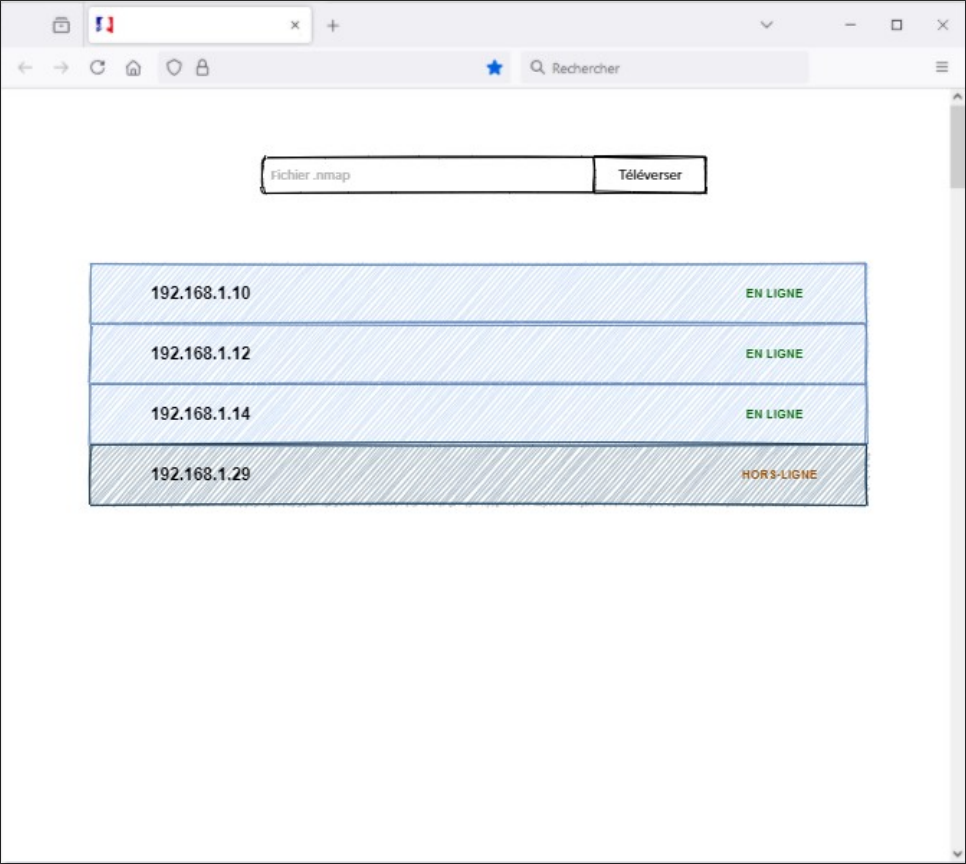
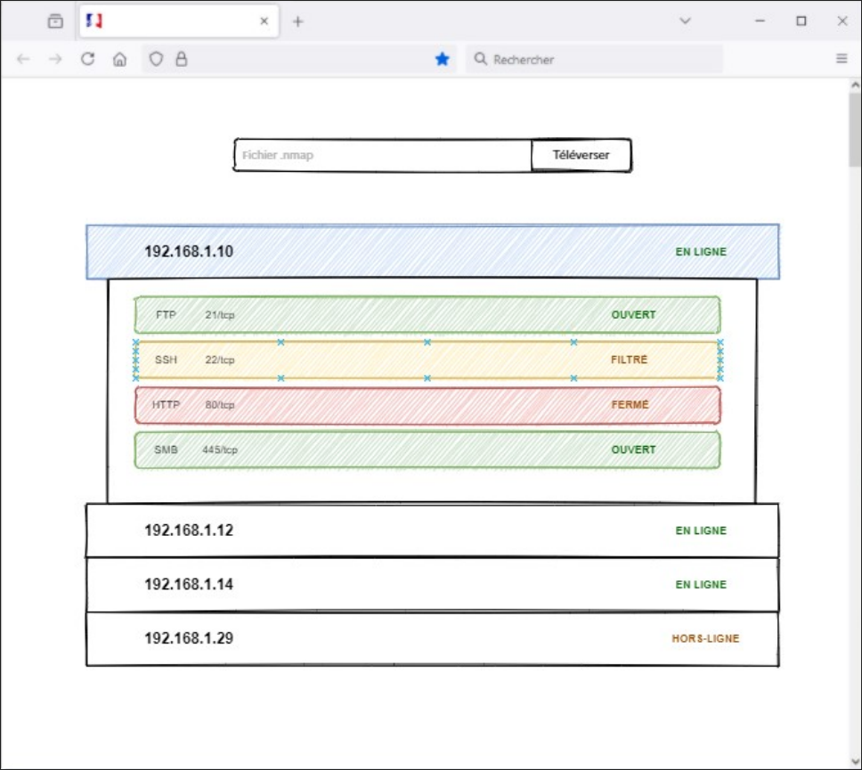
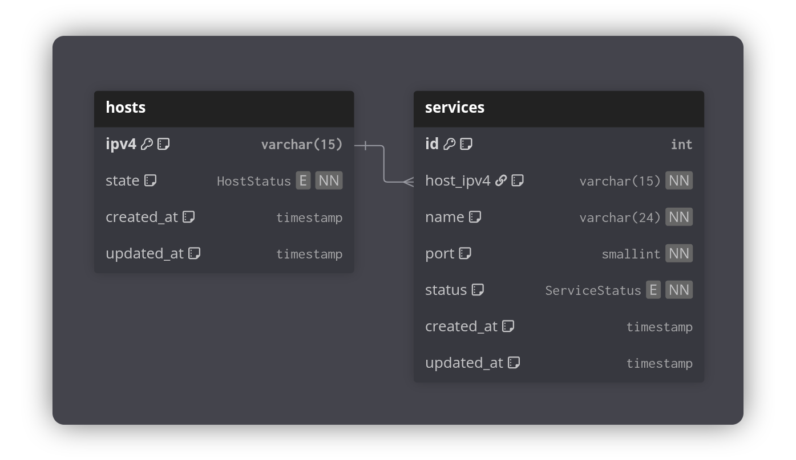

# Nmap Viewer - Test technique

## Énoncé

Réaliser une application web qui permet de :
- Téléverser un ou plusieurs fichiers .nmap
- Afficher un rendu tel que présenté [ci-dessous](#rendu-attendu)
- Sauvegarder le résultat du fichier .nmap en base de données
- Réafficher les résultats stockés en base de données après actualisation de la page

Le candidat a toute liberté sur les choix des technologies.

### Rendu attendu

|                                                                                                 |
|:-----------------------------------------------------------------------------------------------:|
|              **Vue liste**                 |
| **Vue liste avec un élément étendu**    |

## Choix des technologies

| Domaine        | Technologie |
|----------------|-------------|
| Back-end       | NestTS      |
| Front-end      | ViteTS      |
| Base de donnée | Postgresql  |
| ORM            | Prisma      |

## Schéma de la base de donnée

----

Réalisé par Nathan JEANNOT • Étudiant en 3ème année à Epitech Rennes • Décembre 2025.
